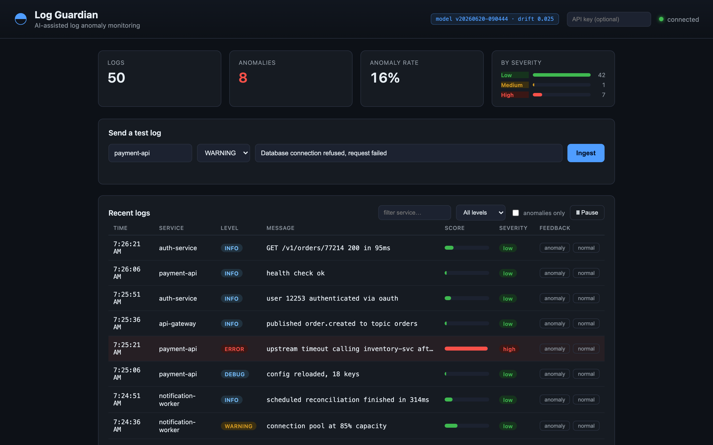

# Log Guardian

A log ingestion platform that scores each entry for anomalies with a trained
model, stores the result, and exposes the whole thing over Prometheus, Grafana
and Jaeger. Two FastAPI services, a Kafka path for volume, a static dashboard,
and manifests to run it on Compose or Kubernetes.



<!-- TODO(hitesh): a paragraph on why you started this - the itch it scratched,
     what you wanted to learn. That is the one thing nobody else can write. -->

```
                 ┌──────────────────┐        ┌──────────────────┐
   logs ───────▶ │ ingestion-service│ ─────▶ │    ai-service    │
                 │   (FastAPI)      │ ◀───── │ anomaly scoring  │
                 └────────┬─────────┘ score  └──────────────────┘
                          │ persist
                          ▼
                 ┌──────────────────┐        ┌───────────────────┐
                 │    PostgreSQL    │        │ Prometheus+Grafana│
                 └──────────────────┘        └───────────────────┘
```

## Services

| Service | Port | Responsibility |
| --- | --- | --- |
| `frontend` | 8080 | Web dashboard to watch logs & anomalies live |
| `ingestion-service` | 8000 | Validate logs, call the AI service, persist, expose them |
| `ai-service` | 8001 | Score a log with a trained model (heuristic fallback) |
| `postgres` | 5432 | Durable log storage |
| `kafka` | 9092 | Streaming ingestion buffer |
| `log-consumer` | – | Consumes streamed logs, scores & persists them |
| `prometheus` | 9090 | Scrape `/metrics`, evaluate alert rules |
| `grafana` | 3000 | Provisioned dashboards (admin/admin) |
| `jaeger` | 16686 | Distributed traces across the services |

## Quick start (Docker)

```bash
make up        # build + start the whole stack
make logs      # tail logs
make down      # stop
```

- **Dashboard** — <http://localhost:8080>
- **API docs** — <http://localhost:8000/docs>
- **Grafana** — <http://localhost:3000> (admin/admin)
- **Prometheus** — <http://localhost:9090>
- **Jaeger** — <http://localhost:16686>

## Quick start (local, no Docker)

```bash
make install                      # venv + dev deps for both services

# terminal 1 — AI service
cd services/ai-service && ../../.venv/bin/uvicorn app.main:app --port 8001

# terminal 2 — ingestion service
cd services/ingestion-service && \
  AI_SERVICE_URL=http://localhost:8001 ../../.venv/bin/uvicorn app.main:app --port 8000
```

Ingestion defaults to a local SQLite file, so there's no Postgres to set up.

## Example

```bash
curl -X POST http://localhost:8000/logs \
  -H 'Content-Type: application/json' \
  -d '{
        "service": "payment-api",
        "level": "CRITICAL",
        "message": "Database connection refused, request failed",
        "timestamp": "2026-06-18T10:00:00Z"
      }'
```

```json
{
  "id": 1, "service": "payment-api", "level": "CRITICAL",
  "message": "Database connection refused, request failed",
  "timestamp": "2026-06-18T10:00:00", "status": "scored",
  "anomaly_score": 1.0, "is_anomaly": true, "predicted_severity": "high"
}
```

Kill the AI service and repeat the request: it still returns 201, with `status:
"unscored"` and null scores. Ingestion never blocks on the model.

## What the real data changed

The model was originally trained on logs generated by a script in this repo. It
scored 0.89 ROC-AUC, which turned out to mean nothing: the generator drew each
label from a sigmoid over log level, message pool and hour of day, and the
featurizer extracted level, keyword count and hour of day. The labels were a
function of the features. The model was recovering a formula I already had.

So the synthetic set is gone, replaced by [BGL](https://github.com/logpai/loghub)
— 4.7M lines from a BlueGene/L supercomputer at LLNL, where each line carries an
alert category assigned by the operators who ran the machine. Real labels,
produced by people who did not know what features anyone would later extract.

Three things fell out of `python ml/data/profile_bgl.py`, and they reframed the
project:

**Severity alone is a perfect recall filter.** All 348,460 alerts sit at
CRITICAL. Not most of them, all of them. No alert appears at ERROR, WARNING or
INFO. But only 40.7% of CRITICAL lines are alerts, so an `if` statement gets you
100% recall at 41% precision and there is nothing for a model to add on that
axis. The open problem is precision inside the critical class.

**The hand-written keyword features are anti-correlated with real alerts.**

```
RISK_KEYWORDS hits vs. label
  keywords             normal      alert   alert rate
  0                 3,631,704    303,890        7.72%
  1                   731,789     44,567        5.74%
  2                     1,224          3        0.24%
```

More risk keywords, *less* likely to be an alert. The list had been reverse
engineered from the synthetic message templates, so of course it was perfect
there. On a real machine the most common line in the entire dataset is
`instruction cache parity error corrected` — it says "error", it's INFO, and
nothing is wrong. Production systems log the word error constantly.

**Failures arrive in bursts, which breaks the obvious evaluation.** 2005-06-12
is 152,183 lines that are 100% alerts; two days in June hold 62% of every alert
in the dataset. A shuffled train/test split scatters near-identical lines from a
single failure across both sides, and you end up scoring memorisation as skill.
The split is chronological for that reason: train through 2005-08-31, hold out
the five months after it (26% of rows, priors 1.3 points apart).

### The bar

`python ml/training/baseline.py`, on the 222,395 held-out rows:

```
  baseline                   precision   recall       f1  roc-auc
  always alert                   0.416    1.000    0.588        -
  never alert                    0.000    0.000    0.000        -
  shipped heuristic              0.416    1.000    0.588    0.407
  component rule                 0.107    0.002    0.004        -
```

The heuristic currently in `analyzer.py` is identical to alerting on everything:
same precision, same recall, it flags all 222,395 rows. Its ROC-AUC of 0.407 is
below 0.5, i.e. it ranks alerts *worse* than a coin flip, because the keyword
boost is its only source of variation and the boost points the wrong way.

Anything that ships has to beat 0.588 F1 and 0.5 AUC. Nothing does yet — see
[limitations](#known-limitations).

## Design decisions

**AI calls are best effort.** A timeout or error from the AI service is logged
and swallowed; the log persists with `status="unscored"`. The alternative was
failing the request, which makes ingestion availability depend on model
availability. For a system whose job is to capture logs, dropping data because a
classifier is down is the wrong trade.

**One `persist_log` for both ingestion paths.** `POST /logs` and the Kafka
consumer call the same function in `app/service.py`. Two implementations would
drift, and then streamed and synchronous logs would be scored differently
without anyone noticing.

**One featurizer, imported by both sides.** `services/ai-service/app/features.py`
is the only place a log becomes a vector, and the training pipeline adds it to
`sys.path` rather than copying it. Train/serve skew is a miserable bug to find.

**BGL rather than HDFS.** HDFS is the more-cited benchmark but it's labelled per
block, so using it means grouping lines into sessions and changing the API from
"score a log" to "score a session". BGL is labelled per line and drops into the
existing contract unchanged.

**Kafka is optional.** Gated behind `KAFKA_ENABLED`, off by default. The service
has to run on a laptop with no broker.

## API

Ingestion service:

- `POST /logs` — ingest and score a log (synchronous)
- `POST /logs/stream` — publish a log to Kafka for async scoring (202)
- `GET /logs?limit=&offset=&service=&level=&anomalous=` — list/filter logs
- `GET /logs/{id}` — fetch one log
- `POST /logs/{id}/feedback` — attach a human label (`{"is_anomaly": bool}`)
- `GET /feedback/export` — labelled examples for retraining
- `GET /model/info` — active model version + metrics (proxied from the AI service)
- `GET /health` · `GET /readiness` · `GET /metrics`

AI service:

- `POST /analyze` — score a log (`anomaly_score`, `is_anomaly`, `predicted_severity`)
- `GET /model/info` — current model version, metric history, drift
- `GET /health` · `GET /metrics`

## The data and model pipeline

```bash
python ml/data/download.py       # BGL from Zenodo, 55 MB zipped
python ml/data/profile_bgl.py    # label distribution vs. current features
python ml/data/prepare.py        # critical subset -> chronological split
python ml/training/baseline.py   # the numbers above
```

Details, including the severity mapping and what the parser throws away, are in
[`ml/README.md`](ml/README.md).

## Feedback loop

Reviewers label logs from the dashboard; labels are stored and served at
`GET /feedback/export`; `make retrain` folds them back in (oversampled so they
actually move the model) and registers a new version in `registry.json`. The AI
service serves the current version, reports it at `GET /model/info`, and watches
the live score distribution against that version's baseline, firing a
`ModelDrift` alert when the two diverge.

## Observability

Prometheus scrapes both services and evaluates the rules in
`monitoring/prometheus/alerts.yml` (service down, high anomaly rate, no logs,
model drift). Grafana provisions its dashboard from `monitoring/grafana/`.

Both services are instrumented with OpenTelemetry, so one request produces one
trace spanning the incoming HTTP call, the call to the AI service, and the
database queries. Streamed logs carry their trace context through Kafka headers,
which means the consumer's work joins the same trace rather than starting a new
one. Logs are JSON with the active `trace_id`. Tracing only turns on when
`OTEL_EXPORTER_OTLP_ENDPOINT` is set, so tests and local runs are unaffected.

## Database migrations

Alembic. The container runs `alembic upgrade head` before serving. Locally:

```bash
cd services/ingestion-service && alembic upgrade head
```

## Tests

91 tests in two tiers. The first needs nothing:

```bash
make test              # 67 tests: ai-service, ingestion, ml, contract
```

The second needs the stack running, because it is specifically about the seams
the first tier replaces with fakes:

```bash
make up
make test-integration  # 16 tests against real containers
make test-e2e          # 8 chromium tests against the dashboard
make smoke             # probe a deployment from outside
```

What the integration tier buys, given the unit suites mock every boundary:

- ingestion reaching the scorer over **real HTTP**, not a `FakeAIClient`
- a log surviving **produce → broker → consume → Postgres**, which nothing else
  covers: the unit test calls `process_record` directly and never involves Kafka
- **one trace spanning both services** through the Kafka headers, checked against
  Jaeger's API and rejecting traces older than the test
- the **Alembic** schema on Postgres rather than SQLite `create_all`
- Prometheus **actually scraping** both targets
- the AI container **stopped outright**, proving a dropped connection degrades to
  `status: "unscored"` and a 201 — a real failure, not the tidy `None` the unit
  suite fakes

A contract test compares the two services' JSON schemas, since they duplicate
the wire format deliberately and nothing else stops them drifting.

CI runs six jobs: four unit suites in a matrix, lint, `kubectl kustomize`, the
integration and browser tests against a Compose stack, and a training smoke
test. Dashboard screenshots are uploaded as a build artifact.

### Load

`make loadtest` runs k6 against the stack. Latest run, with method and hardware,
is in [`loadtest/results/`](loadtest/results/README.md):

| metric | value |
| --- | --- |
| throughput | 190.9 req/s |
| failed | 0.00% (0 of 3,869) |
| median | 19.4 ms |
| p95 (all) | 120.0 ms |
| p95 (stream only) | 52.2 ms |

Everything on one M1 laptop, load generator included, so treat these as
contention numbers. The streaming path being 2.3× faster at p95 is the point:
it returns once Kafka accepts the message instead of blocking on the scorer.

## Kubernetes

```bash
kubectl apply -k infrastructure/kubernetes
```

Postgres, both services (ingestion with an HPA), Kafka and the consumer, the
frontend, an ingress, and the monitoring stack. Image building and access notes
are in [`infrastructure/kubernetes/README.md`](infrastructure/kubernetes/README.md).

## Known limitations

Things that are wrong or missing, in roughly the order they'd bite:

- **The deployed model is still the synthetic one.** BGL data, split and
  baselines exist; the retrain on real data does not. `registry.json` reports
  metrics measured on the synthetic set, which for the reasons above should be
  read as meaningless rather than good.
- **The rate limiter is per process.** `RateLimiter` keeps hits in a local dict,
  but the deployment runs 2 replicas and scales to 6, so the effective limit is
  up to 6× what's configured. Needs Redis to be real.
- **Auth is off by default.** `API_KEY` empty disables the `X-API-Key` check and
  `CORS_ALLOW_ORIGINS` defaults to `*`. Deployed as-is, `POST /logs` is an open
  write endpoint.
- **No image pipeline.** The manifests reference `log-guardian/*:latest` with
  `imagePullPolicy: IfNotPresent`, so they only work against a local daemon.
  There's no path from push to cluster.
- **Containers run as root**, and no manifest sets a `securityContext`.
- **Secrets are plaintext** `stringData` in the manifests.
- **Kafka is a single broker** with replication factor 1. Fine for a demo, not
  a buffer you'd trust.
- **`infrastructure/kubernetes/monitoring-config/` duplicates `monitoring/`**
  because kustomize can't read outside its own directory. Both must be edited
  together and nothing enforces that.
- **Load numbers are from a single laptop.** Load generator, both services,
  Postgres, Kafka and the monitoring stack all share eight cores, so the p95 of
  120 ms says as much about contention as about the services. Nothing has been
  measured on separated hosts.

## Next

- [ ] Drain3 template features, then retrain on BGL and see if it clears 0.588 F1
- [ ] Build and push images from CI so the k8s manifests point at a registry
- [ ] Deploy it somewhere real, with the API key actually set
- [ ] Move the rate limiter to Redis, or document it as per-pod and move on

See [`docs/architecture.md`](docs/architecture.md) for design details.
