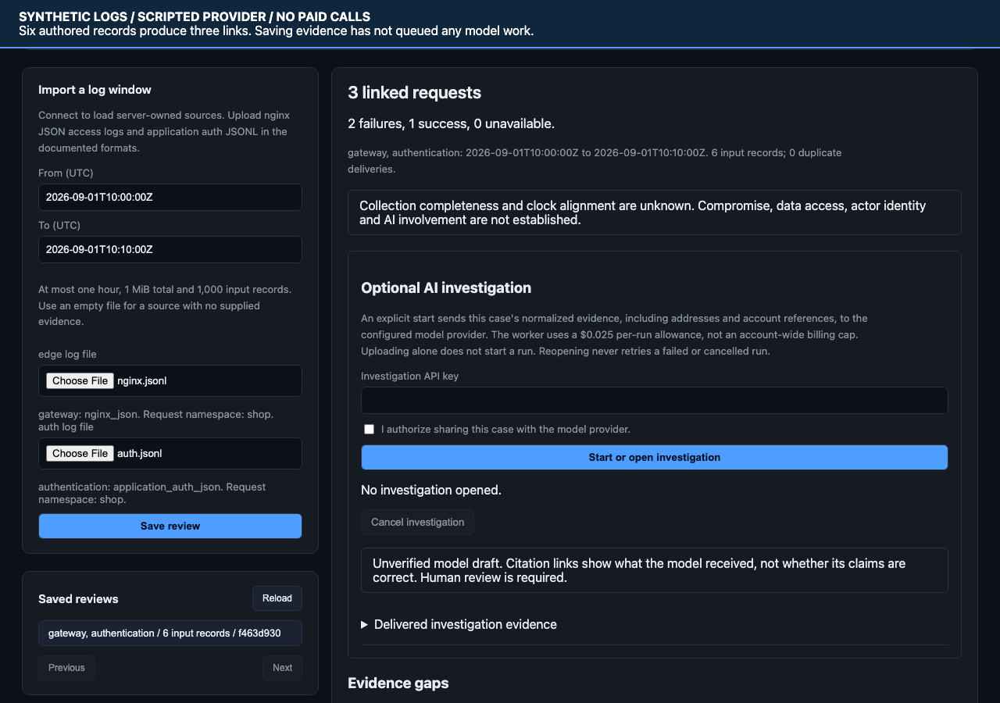

# Log Guardian

Investigate suspicious activity against a business or product using gateway and
application authentication logs. Import a bounded log window, inspect linked requests
and explicit auth outcomes, then optionally ask an AI investigator to review that saved
evidence. The result is a draft with citations and gaps, not an automated attack verdict.

[](frontend/media/security-review.webm)

[Watch the recording](frontend/media/security-review.webm) ·
[Setup and trust boundaries](docs/security-log-review.md) ·
[Verification and recording provenance](docs/verification/security-story/README.md)

The recording uses the working browser UI, real import API, SQLite and queue worker.
Six authored records produce three request links, two authentication failures and one
success. The provider response is scripted. No customer traffic or paid model calls
are involved, and displayed model usage is simulated.

## What the workflow answers

- Which supplied gateway requests match authentication results on an owner-configured
  request-ID namespace?
- Which accounts and ingress-observed addresses occur in the supplied records?
- What failed, what succeeded, and which records remain ambiguous or unlinked?
- What evidence is missing before claiming compromise, data access or a shared actor?

HTTP 200 does not prove authentication success. A successful login does not prove
compromise. Addresses are not people, and similar timing does not establish coordination
or AI involvement. Collection completeness and clock alignment remain unknown.

```text
[Owner source registry] -> [Gateway + auth import] -> [Saved timeline and gaps]
                                                            |
                                                  explicit execution key
                                                            v
[Human review] <--------- [Cited, unverified draft] <- [Case-only read tool]
```

## Try it without a model key

For a read-only video preview, export static files and serve them on a free local port:

```bash
python scripts/export_static_demo.py
python -m http.server 8483 --bind 127.0.0.1 --directory site
```

Open <http://127.0.0.1:8483/security-preview.html>. It has a video, native playback
controls and a text transcript. It cannot upload files or execute investigations.
The export's index retains the older operational-investigator recordings.

To use the real importer, follow [local security-review setup](docs/security-log-review.md#local-setup).
It needs SECURITY_SOURCES_PATH, SECURITY_API_KEY and a database migrated to head.
The guide includes prescribed nginx JSON and application-auth JSONL formats and the
six-record example. Arbitrary nginx combined logs are not supported.

Import and review use SECURITY_API_KEY. AI execution needs a distinct
INVESTIGATION_API_KEY, provider-sharing consent in the UI and a separately configured
worker. Importing never queues model work. One saved case gets one run, including after
failure or cancellation. Review keys cannot inspect or cancel paid runs.

The worker checks the saved source binding and exposes only read_security_evidence.
It does not search operational logs, other cases, metrics or runbooks for a security
case. Existing limits include six provider requests, eight tool executions, 64 KiB of
evidence and a $0.025 per-run allowance. That estimate is not an account-wide billing cap.
Do not start a live worker against queued cases without current spending authorization.

## Implemented and unproven

The repository has authenticated imports, duplicate/conflict handling, SQLite/PostgreSQL
migrations, deterministic correlation, browser review and explicit case-bound execution.
The connection has scripted-provider verification, not a live security-diagnosis result.
There is no validated credential-stuffing classifier or automatic blocking/remediation.
This is development software, not a deployed customer security service.

Reports must cite delivered evidence, but membership does not establish semantic support.
Earlier investigator experiments produced unsupported claims and unsafe advice despite
valid citations. The [experimental verifier](evals/report-verifier-v2/README.md) is not a
production gate. Human review, consent, retention policy, independent labels and workload
measurement remain necessary before a customer pilot.

## Optional integration and historical research

The dependency-free [Python agent recorder](integrations/python/README.md) and its
[investigator example](integrations/python/examples/investigator.py) remain available
for businesses that operate agents. The recorder observes wrapped calls and compares
tool names with an owner allowlist. It neither detects external attackers nor proves
complete capture. Its [illustrative agent preview](https://github.com/HitendraKawale/log-guardian/blob/eda0427/frontend/security-prototype.html)
is a separate historical prototype, not the main security workflow.

Operational investigations, the scorer and their preserved experiments remain part of
the project. [Evaluation method and full scorecard](docs/evaluation.md),
[older 90-second operational recording](docs/media/demo-90s.webm) and the
[public operational demo](https://hitendrakawale.github.io/log-guardian/) describe that
work. The public site has not been redeployed with this security recording.

The following results are from the older operational corpus, not security-case accuracy
or the project's current total spend. On that held-out split, fixed retrieval **B scored 13/16** core
review passes at $0.024 total, the adaptive agent **C scored 11/16** at
$0.029. The adaptive hypothesis was **not supported** on this corpus. All 92
live runs (152 requests, est. $0.128 total) are preserved byte-for-byte with
provenance under `evals/results/`.

A separate [live sandbox investigation](demo/investigations/2026-09-14-live-sandbox/)
completed through the queue worker for $0.00229760. C cited real logs showing
inventory latency exceeding checkout's deadline. The archive records the
scenario-label leakage and missing worker revision; this is not another held-out
benchmark. Total estimated spend including this run is $0.13033360.

The adaptive loop did not beat fixed retrieval on that corpus. The synthetic-trained
anomaly scorer reproduced F1 0.588 / ROC-AUC 0.407 on BGL; the later BGL-trained model
is described below. The schema-order abstention fix coincided with improvement on one
case and is not a proven cause. Consumed held-out splits cannot support a new independent
claim after tuning.

## Optional operational log collection

[Local Compose onboarding](docs/local-development.md) runs ingestion and the dashboard
without a model worker. An owner-run Python command forwards one Compose service's
stdout, with no Docker socket mount. The dashboard separates API reachability from
the latest observed log. Start with `make local-up` after setting
`LOG_GUARDIAN_API_KEY` as documented.

This is a development installation, not a paid hosted release. Collection has no
durable spool or automatic retry, and retention is not implemented. Recurring
error detection uses persisted per-service learning and groups repeats until ten
quiet minutes pass. The Candidates view explains each signal and learning state.
See [detector policy and upgrades](docs/local-development.md#detector-policy-and-upgrades)
for thresholds, timestamp exclusions and failure limits. AI execution stays disabled
in the local profile.

## Operational investigation sandbox

```bash
make demo-up                 # minimal stack: no Kafka/Grafana/Kubernetes
python demo/run_scenario.py  # owner-only fault: real 504s, then recovery
make demo-down
```

Investigations are disabled until `INVESTIGATION_API_KEY` is set (every
endpoint returns 503). The worker (`python -m app.investigator`) fails closed
without `OPENAI_API_KEY` — no fabricated reports. Live model calls cost real
money. Starting a configured worker enables spending on queued investigations;
it has no account-wide allowance ledger.

---

The underlying log platform:

```
                 ┌──────────────────┐        ┌──────────────────┐
   logs ───────▶ │ ingestion-service│ ─────▶ │    ai-service    │
                 │   (FastAPI)      │ ◀───── │ anomaly scoring  │
                 └────────┬─────────┘ score  └──────────────────┘
                          │ persist
                          ▼
                 ┌──────────────────┐        ┌───────────────────┐
                 │    PostgreSQL    │        │ Prometheus+Grafana│
                 └──────────────────┘        └───────────────────┘
```

## Services

| Service | Port | Responsibility |
| --- | --- | --- |
| `frontend` | 8080 | Web dashboard to watch logs & anomalies live |
| `ingestion-service` | 8000 | Validate logs, call the AI service, persist, expose them |
| `ai-service` | 8001 | Score a log with a trained model (heuristic fallback) |
| `postgres` | 5432 | Durable log storage |
| `kafka` | 9092 | Streaming ingestion buffer |
| `log-consumer` | – | Consumes streamed logs, scores & persists them |
| `prometheus` | 9090 | Scrape `/metrics`, evaluate alert rules |
| `grafana` | 3000 | Provisioned dashboards (admin/admin) |
| `jaeger` | 16686 | Distributed traces across the services |

## Quick start (Docker)

```bash
make up        # build + start the whole stack
make logs      # tail logs
make down      # stop
```

- **Dashboard** — <http://localhost:8080> (Investigations · Candidates · Logs · Evaluations)
- **API docs** — <http://localhost:8000/docs>
- **Grafana** — <http://localhost:3000> (admin/admin)
- **Prometheus** — <http://localhost:9090>
- **Jaeger** — <http://localhost:16686>

## Quick start (local, no Docker)

```bash
make install                      # venv + dev deps for both services

# terminal 1 — AI service
cd services/ai-service && ../../.venv/bin/uvicorn app.main:app --port 8001

# terminal 2 — ingestion service
cd services/ingestion-service && \
  AI_SERVICE_URL=http://localhost:8001 ../../.venv/bin/uvicorn app.main:app --port 8000
```

Ingestion defaults to a local SQLite file, so there's no Postgres to set up.

## Example

```bash
curl -X POST http://localhost:8000/logs \
  -H 'Content-Type: application/json' \
  -d '{
        "service": "payment-api",
        "level": "CRITICAL",
        "message": "Database connection refused, request failed",
        "timestamp": "2026-06-18T10:00:00Z"
      }'
```

```json
{
  "id": 1, "service": "payment-api", "level": "CRITICAL",
  "message": "Database connection refused, request failed",
  "timestamp": "2026-06-18T10:00:00", "status": "scored",
  "anomaly_score": 1.0, "is_anomaly": true, "predicted_severity": "high"
}
```

Kill the AI service and repeat the request: it still returns 201, with `status:
"unscored"` and null scores. Ingestion never blocks on the model.

<details>
<summary>Historical scoring study: what real BGL data changed</summary>

## What the real data changed

The model was originally trained on logs generated by a script in this repo. It
scored 0.89 ROC-AUC, which turned out to mean nothing: the generator drew each
label from a sigmoid over log level, message pool and hour of day, and the
featurizer extracted level, keyword count and hour of day. The labels were a
function of the features. The model was recovering a formula I already had.

So the synthetic set is gone, replaced by [BGL](https://github.com/logpai/loghub)
— 4.7M lines from a BlueGene/L supercomputer at LLNL, where each line carries an
alert category assigned by the operators who ran the machine. Real labels,
produced by people who did not know what features anyone would later extract.

Three things fell out of `python ml/data/profile_bgl.py`, and they reframed the
project:

**Severity alone is a perfect recall filter.** All 348,460 alerts sit at
CRITICAL. Not most of them, all of them. No alert appears at ERROR, WARNING or
INFO. But only 40.7% of CRITICAL lines are alerts, so an `if` statement gets you
100% recall at 41% precision and there is nothing for a model to add on that
axis. The open problem is precision inside the critical class.

**The hand-written keyword features are anti-correlated with real alerts.**

```
RISK_KEYWORDS hits vs. label
  keywords             normal      alert   alert rate
  0                 3,631,704    303,890        7.72%
  1                   731,789     44,567        5.74%
  2                     1,224          3        0.24%
```

More risk keywords, *less* likely to be an alert. The list had been reverse
engineered from the synthetic message templates, so of course it was perfect
there. On a real machine the most common line in the entire dataset is
`instruction cache parity error corrected` — it says "error", it's INFO, and
nothing is wrong. Production systems log the word error constantly.

**Failures arrive in bursts, which breaks the obvious evaluation.** 2005-06-12
is 152,183 lines that are 100% alerts; two days in June hold 62% of every alert
in the dataset. A shuffled train/test split scatters near-identical lines from a
single failure across both sides, and you end up scoring memorisation as skill.
The split is chronological for that reason: train through 2005-08-31, hold out
the five months after it (26% of rows, priors 1.3 points apart).

### The bar

`python ml/training/baseline.py`, on the 222,395 held-out rows:

```
  baseline                   precision   recall       f1  roc-auc
  always alert                   0.416    1.000    0.588        -
  never alert                    0.000    0.000    0.000        -
  shipped heuristic              0.416    1.000    0.588    0.407
  component rule                 0.107    0.002    0.004        -
```

The heuristic currently in `analyzer.py` is identical to alerting on everything:
same precision, same recall, it flags all 222,395 rows. Its ROC-AUC of 0.407 is
below 0.5, i.e. it ranks alerts *worse* than a coin flip, because the keyword
boost is its only source of variation and the boost points the wrong way.

Anything that ships has to beat 0.588 F1 and 0.5 AUC.

### Clearing it

`python ml/training/train_bgl.py` fits the shipped artifact on the real split;
`python ml/training/evaluate.py` scores it once on the same 222,395 held-out
rows:

```
  model      v20260915-020822 (source: bgl), threshold 0.03
  precision      0.947
  recall         1.000
  f1             0.973
  roc-auc        0.999
```

Two of the three fixes were bugs rather than modelling. The training holdout was
a *random* split, which on bursty logs scores memorisation as skill; it is now
chronological. The decision threshold was assumed to be 0.50 rather than fitted;
it is now chosen on a holdout inside the training window and recorded on the
registry entry. The third fix was replacing the five numeric features — level is
constant on the CRITICAL subset and the hand-written keywords point the wrong
way — with the message text.

The plan had been to template the messages first, replacing paths and addresses
with placeholders the way Drain does. Measured, that makes it worse, and worst
on exactly the rows it was meant to help: on held-out lines whose template was
never seen in training, ROC-AUC falls from 0.989 to 0.932. BGL's variable parts
are not noise — `ciod: Error loading /bgl/apps/SWL/...` is a user's own broken
job, and the path is the evidence. The full comparison against Drain3 and the
loglizer baselines is in
[`docs/model-comparison.md`](docs/model-comparison.md); the feature ablation is
in [`ml/README.md`](ml/README.md).

### What the scorer still cannot do

F1 0.973 does not make it deployable as a detector. It needs labels — BGL has
them because LLNL operators tagged 348,460 lines by hand — and it is fitted on
one machine's vocabulary, so it returns 0.0 for the ERROR-level traffic the demo
sandbox emits.

The original novelty-only baseline remains in
`services/ingestion-service/app/trigger.py` for `make measure-trigger`: a
severity gate plus "this message template has not been seen before". Held out on
BGL it surfaces **76.5% of alerting message families** while raising candidates
on **0.84% of rows**, with nothing to train. On the demo capture — where the
scorer is silent — it raised one candidate, the incident line itself.

The same templating that *lost* for the model wins here: novelty detection is
meaningless without it, because every new file path would make a line unique.
Details and the honest caveats are in [`ml/README.md`](ml/README.md).

The runtime detector now adds persisted per-service burst detection and recurring
incident grouping in `app/incident_detection.py`. The BGL measurements above
remain historical novelty-only results, not accuracy measurements for this new
application-log detector.

Selecting is not spending. A candidate is a suggestion for a human or an
explicitly-budgeted worker; wiring it straight into the investigation worker
would make log volume drive paid execution.

</details>

## Design decisions

**AI calls are best effort.** A timeout or error from the AI service is logged
and swallowed; the log persists with `status="unscored"`. The alternative was
failing the request, which makes ingestion availability depend on model
availability. For a system whose job is to capture logs, dropping data because a
classifier is down is the wrong trade.

**One `persist_log` for both ingestion paths.** `POST /logs` and the Kafka
consumer call the same function in `app/service.py`. Two implementations would
drift, and then streamed and synchronous logs would be scored differently
without anyone noticing.

**One featurizer, imported by both sides.** `services/ai-service/app/features.py`
is the only place a log becomes a vector, and the training pipeline adds it to
`sys.path` rather than copying it. Train/serve skew is a miserable bug to find.

**BGL rather than HDFS.** HDFS is the more-cited benchmark but it's labelled per
block, so using it means grouping lines into sessions and changing the API from
"score a log" to "score a session". BGL is labelled per line and drops into the
existing contract unchanged.

**Kafka is optional.** Gated behind `KAFKA_ENABLED`, off by default. The service
has to run on a laptop with no broker.

## API

Security evidence, protected by the review key:

- `GET /security/sources`: owner-registered source formats and limits
- `POST /security/cases`: bounded import with an Idempotency-Key
- `GET /security/cases`: saved review summaries
- `GET /security/cases/{id}`: normalized timeline, counts, gaps and source snapshot

Explicit execution, protected by the investigation key:

- `POST /investigations/from-security-case/{id}`: create or reopen the single bound run
- `GET /investigations/{id}` and `/events`: draft, status and delivered evidence
- `POST /investigations/{id}/cancel`: request cancellation, not a billing reversal

Operational ingestion service:

- `POST /logs` — ingest and score a log (synchronous)
- `POST /logs/stream` — publish a log to Kafka for async scoring (202)
- `GET /logs?limit=&offset=&service=&level=&anomalous=` — list/filter logs
- `GET /logs/{id}` — fetch one log
- `POST /logs/{id}/feedback` — attach a human label (`{"is_anomaly": bool}`)
- `GET /feedback/export` — labelled examples for retraining
- `GET /model/info` — active model version + metrics (proxied from the AI service)
- `GET /candidates?status=&service=&limit=&offset=` — the investigation queue
- `GET /candidates/detectors?service=&limit=&offset=` — per-service detector readiness
- `GET /candidates/{id}` · `POST /candidates/{id}/dismiss` — review one
- `GET /health` · `GET /readiness` · `GET /metrics`

Candidates are what the label-free trigger selected as worth investigating. That
router can list and dismiss; it cannot start an investigation, because starting
one spends money. Promotion lives on the investigations router instead:

- `POST /investigations/from-candidate/{id}` — queue a paid run from a candidate

so reviewing the queue and spending against it are separate keys. Promotion is
idempotent through the candidate's investigation link: promoting twice returns
the first run rather than paying for the same question again.

AI service:

- `POST /analyze` — score a log (`anomaly_score`, `is_anomaly`, `predicted_severity`)
- `GET /model/info` — current model version, metric history, drift
- `GET /health` · `GET /metrics`

## The data and model pipeline

```bash
python ml/data/download.py       # BGL from Zenodo, 55 MB zipped
python ml/data/profile_bgl.py    # label distribution vs. current features
python ml/data/prepare.py        # critical subset -> chronological split
python ml/training/baseline.py   # the numbers above
```

Details, including the severity mapping and what the parser throws away, are in
[`ml/README.md`](ml/README.md).

## Feedback loop

Reviewers label logs from the dashboard; labels are stored and served at
`GET /feedback/export`; `make retrain` folds them back in (oversampled so they
actually move the model) and registers a new version in `registry.json`. The AI
service serves the current version, reports it at `GET /model/info`, and watches
the live score distribution against that version's baseline, firing a
`ModelDrift` alert when the two diverge.

## Observability

Prometheus scrapes both services and evaluates the rules in
`monitoring/prometheus/alerts.yml` (service down, high anomaly rate, no logs,
model drift). Grafana provisions its dashboard from `monitoring/grafana/`.

Both services are instrumented with OpenTelemetry, so one request produces one
trace spanning the incoming HTTP call, the call to the AI service, and the
database queries. Streamed logs carry their trace context through Kafka headers,
which means the consumer's work joins the same trace rather than starting a new
one. Logs are JSON with the active `trace_id`. Tracing only turns on when
`OTEL_EXPORTER_OTLP_ENDPOINT` is set, so tests and local runs are unaffected.

## Database migrations

Alembic. The container runs `alembic upgrade head` before serving. Locally:

```bash
cd services/ingestion-service && ../../.venv/bin/python -m alembic upgrade head
```

## Tests

Offline checks and the sandbox require no external infrastructure:

```bash
make test              # service, ML, contract, offline eval, forwarder and recorder suites
make test-demo         # in-process fault/recovery sandbox
```

The second needs the stack running, because it is specifically about the seams
the first tier replaces with fakes:

```bash
make up
make test-integration  # real service, Kafka, tracing and PostgreSQL checks
make test-e2e          # Chromium checks, including isolated security-review API/worker fixtures
make smoke             # probe a deployment from outside
```

What the integration tier buys, given the unit suites mock every boundary:

- ingestion reaching the scorer over **real HTTP**, not a `FakeAIClient`
- a log surviving **produce → broker → consume → Postgres**, which nothing else
  covers: the unit test calls `process_record` directly and never involves Kafka
- **one trace spanning both services** through the Kafka headers, checked against
  Jaeger's API and rejecting traces older than the test
- the **Alembic** schema on Postgres rather than SQLite `create_all`
- Prometheus **actually scraping** both targets
- the AI container **stopped outright**, proving a dropped connection degrades to
  `status: "unscored"` and a 201 — a real failure, not the tidy `None` the unit
  suite fakes

A contract test compares the two services' JSON schemas, since they duplicate
the wire format deliberately and nothing else stops them drifting.

CI includes eight test-matrix entries, including the demo and recorder suites, plus
lint, Kubernetes manifest validation, Compose integration/browser tests and a training
smoke test. Screenshots are uploaded as an artifact. The security connection checkpoint
passed 758 offline checks, six demo checks and 40 browser checks; those counts describe
that checkpoint, not a permanent suite size. See [connection verification](docs/verification/security-investigator/README.md)
and [the passing follow-up CI run](https://github.com/HitendraKawale/log-guardian/actions/runs/36229166454).

### Load

`make loadtest` runs k6 against the stack. Latest run, with method and hardware,
is in [`loadtest/results/`](loadtest/results/README.md):

| metric | value |
| --- | --- |
| throughput | 190.9 req/s |
| failed | 0.00% (0 of 3,869) |
| median | 19.4 ms |
| p95 (all) | 120.0 ms |
| p95 (stream only) | 52.2 ms |

Everything on one M1 laptop, load generator included, so treat these as
contention numbers. The streaming path being 2.3× faster at p95 is the point:
it returns once Kafka accepts the message instead of blocking on the scorer.

## Kubernetes

```bash
kubectl apply -k infrastructure/kubernetes
```

Postgres, both services (ingestion with an HPA), Kafka and the consumer, the
frontend, an ingress, and the monitoring stack. Image building and access notes
are in [`infrastructure/kubernetes/README.md`](infrastructure/kubernetes/README.md).

## Known limitations

Things that are wrong or missing, in roughly the order they'd bite:

- **The committed scorer only scores CRITICAL logs.** It is fitted on BGL's
  CRITICAL subset, where every operator-labelled alert lives, and the registry
  records that pool so the service returns 0.0 for other severities rather than
  extrapolating. That is the honest behaviour, but it means the model
  contributes nothing to the application-log demo, whose traffic is mostly
  ERROR and WARNING. The severity gate is a deliberate rule, not a learned one.
- **The model is domain-specific.** BGL is supercomputer RAS logging. Nothing
  here shows the templates transfer to application logs, and the demo sandbox's
  messages are out of its vocabulary.
- **The rate limiter is per process.** `RateLimiter` keeps hits in a local dict,
  but the deployment runs 2 replicas and scales to 6, so the effective limit is
  up to 6× what's configured. Needs Redis to be real.
- Operational log auth is off by default. An empty `API_KEY` disables its check,
  and `CORS_ALLOW_ORIGINS` defaults to `*`. In contrast, empty SECURITY_API_KEY or
  INVESTIGATION_API_KEY disables the corresponding security-review or execution API.
  Configure distinct keys, explicit CORS origins and TLS before exposing services.
- **No image pipeline.** The manifests reference `log-guardian/*:latest` with
  `imagePullPolicy: IfNotPresent`, so they only work against a local daemon.
  There's no path from push to cluster.
- **Containers run as root**, and no manifest sets a `securityContext`.
- **Secrets are plaintext** `stringData` in the manifests.
- **Kafka is a single broker** with replication factor 1. Fine for a demo, not
  a buffer you'd trust.
- **`infrastructure/kubernetes/monitoring-config/` duplicates `monitoring/`**
  because kustomize can't read outside its own directory. Both must be edited
  together and nothing enforces that.
- **Load numbers are from a single laptop.** Load generator, both services,
  Postgres, Kafka and the monitoring stack all share eight cores, so the p95 of
  120 ms says as much about contention as about the services. Nothing has been
  measured on separated hosts.

## Next

- [ ] Prepare a fresh business-security evaluation corpus with benign counterexamples
  and independently reviewed expected judgments.
- [ ] Freeze the candidate and obtain explicit per-batch approval before a real-model pilot.
- [ ] Define consent, retention, collection coverage and deployment security for any
  customer-data trial. There is no current deployment authorization.
- [ ] Measure workload limits before adding collectors, distributed rate limits or
  hosted execution. Existing laptop numbers are not production capacity evidence.

See [`docs/architecture.md`](docs/architecture.md) for design details.
